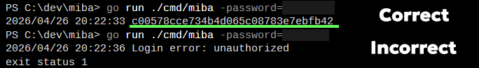

# MiBA

*MiBA - **Mi** login **B**ypass **A**ttempt*

## What is it?
It's my small experiment when I tried to reverse login process in **Mi Router** to understand how to get `stok` token and use it in their API.
I wrote it long ago, but decided to refactor to make more readable and safe from *nils*.

It was tested **ONLY** on **Mi Router 4A**, so I cannot guarantee it can work on other models.

## How to use it?
If you want to get access token, or how they name it - `stok` token:
- Clone repository with `git clone https://github.com/TechAngle/miba.git`
- Run it with 
```bash
$ go run ./cmd/miba -password=<password>
```
- If you have entered correct password, it should give you `stok` token that can be used.

## Interesting note
I hated how they made requests responses. It returns *200 OK*, but in response there is a field `code` which contains **REAL** status code (e.g. **401**).

## Result screenshot

